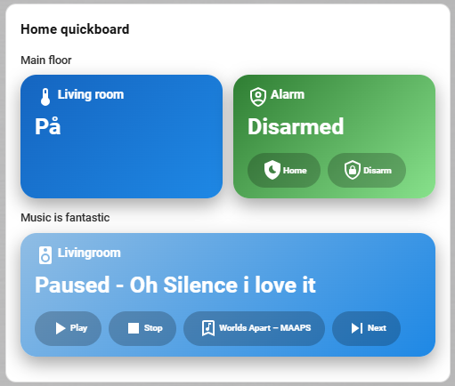
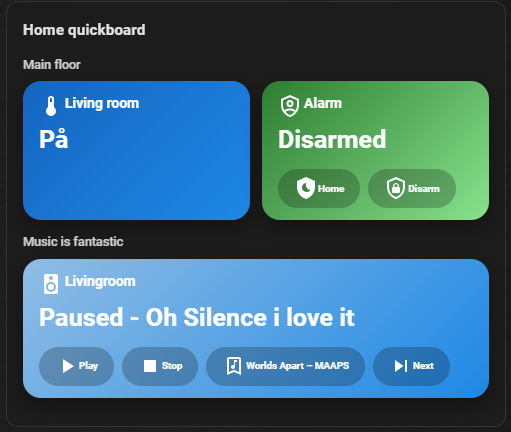
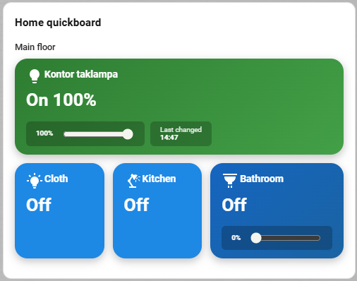
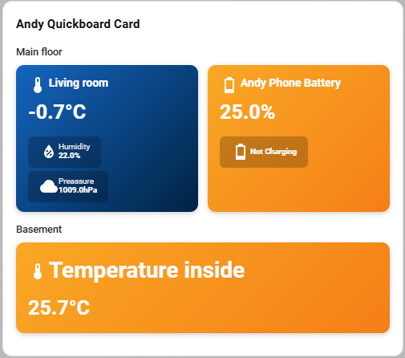
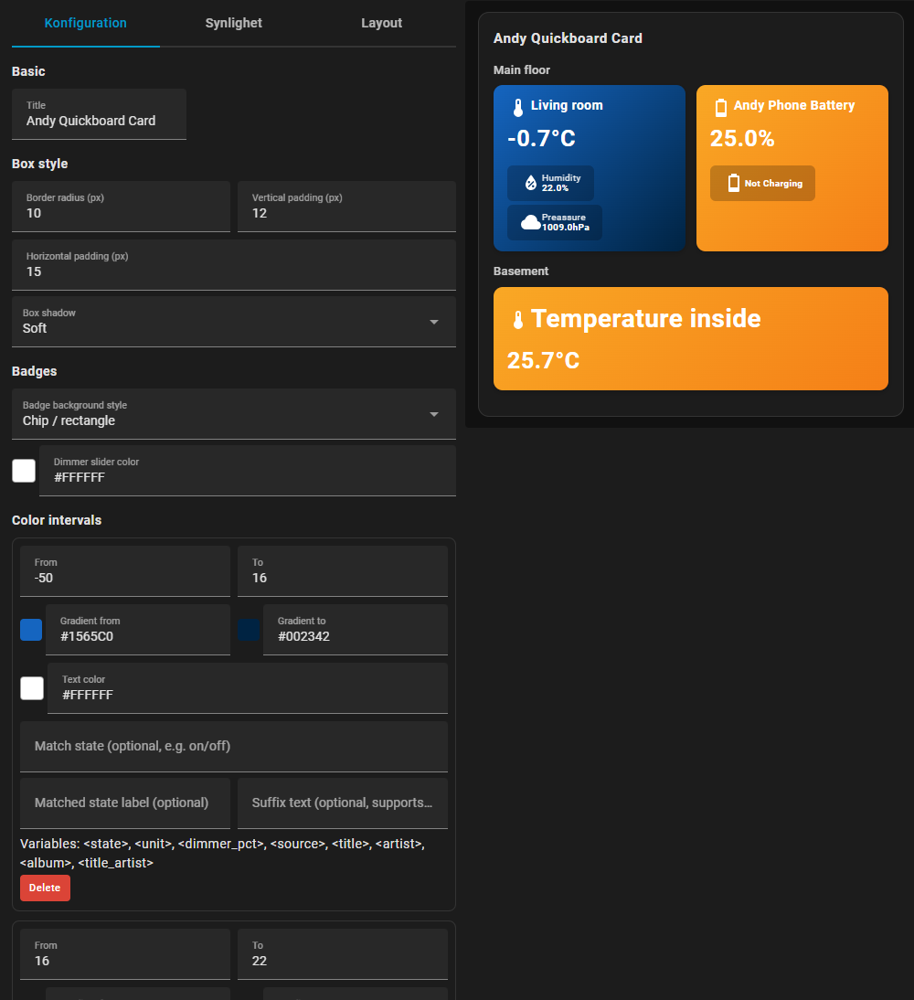

# Andy Quickboard Card
A powerful and highly flexible Lovelace card that lets you build multi-entity dashboards arranged over any number of rows. Each entity tile can be fully customized with dynamic colors based on numeric ranges or state matching, including gradients and text color overrides.

Every entity supports multiple badges that can display additional information or perform actions. Badges can show sensor values, statistics, media information, alarm states, dimmer levels, last changed, and more — or trigger controls such as Media Player actions, Alarm Panel commands, light toggles, and dimmer sliders.

You can insert dynamic variables into labels or suffix text (e.g. <title>, <artist>, <state>, <unit>, <dimmer_pct>, etc.) to display context-aware information directly on the card.
You may also override default state labels (e.g., show “Lamp turned on” instead of just “on”) or add custom suffix messages.

Icon handling is fully configurable: choose a single icon per entity or supply a list of state-based icons (different icons for on, off, playing, paused, etc.).

In short:
This is an extremely configurable and versatile quickboard card that allows you to build beautiful multi-entity layouts with rich functionality in just a few minutes,  limited only by your imagination.


Show multiple rooms / devices in a compact board with:
- Gradient heatmap backgrounds (per value or per state)
- Custom per-entity colors (override intervals)
- Multiple badges per entity (value, stats, dimmer, media, alarm, media info, …)
- State-based icons (e.g. light on/off icons)
- Context-aware actions (toggle light, run script, open alarm panel, media controls)
- Powerful visual editor with rows, entities, badges and color intervals

> Developed by **Andreas “AndyBonde”** – same author as
> [`andy-temperature-card`](https://github.com/maglerod/andy-temperature-card) and  
> [`andy-segment-display-card`](https://github.com/maglerod/andy-segment-display-card).

---
## Screenshots








---

## Features

- 🔥 **Heatmap / gradient backgrounds**
  - Global color intervals based on numeric value or exact state
  - Per-interval text color
  - Optional suffix text with variables (`<state>`, `<unit>`, `<dimmer_pct>`, `<source>`, `<title>`, `<artist>`, `<album>`, `<title_artist>`)

- 🎨 **Per-entity custom colors**
  - Each entity can override intervals with its own gradient `from/to`
  - Global box style: border radius, padding and shadow presets
  - Badge background, several choices!

- 🧱 **Rows & entities**
  - Build your own layout row-by-row
  - Each row has optional label & position (top/bottom left/center/right)
  - Entities auto-size to fill row width (2, 3, 4+ per row)
  - Collapsible editor sections with “Expand all / Collapse all”

- 🧩 **Badges (per entity)**
  - **Value** – show another entity’s current value
  - **Dimmer** – slider + % for light entities (live control)
  - **Stats** – min / max / avg / last on / last off / last changed (REST history)
  - **Media control** – play / pause / stop / next / previous / volume / mute
  - **Media info** – title / artist / album / source / title+artist
  - **Alarm control** – arm/disarm actions with optional code
  - Optional icon + label per badge, several background styles (pill, chip, underline, none)

- 💡 **State-based icons**
  - Per entity you can:
    - Use a single icon, **or**
    - Define a list of `state → icon` mappings (e.g. `on` → `mdi:lightbulb-on`, `off` → `mdi:lightbulb-off-outline`)

- 🧠 **Smart click behaviour**
  - Scripts → `script.turn_on`
  - Lights / switches / fans / input_booleans → toggle
  - Alarm control panel / media player → Hass more-info + dedicated badge controls
  - Everything else → standard more-info dialog

- 🧰 **Card-mod friendly**
  - The card is a normal `ha-card` – works fine with `card-mod` for background, blur, etc.

---

## Installation

### Option A — Install via HACS (published repository)
1. Open **HACS** in Home Assistant.
2. Go to **Frontend**.
3. Search for **Andy Quickboard Card** or only seach for Andy and find Quickboard.
4. Open the card and click **Download**, choose latest version.
5. Restart Home Assistant (or reload frontend resources).

After installation, the Lovelace resource is usually added automatically by HACS.  
If not, see **“Add as a resource”** below.

---

### Option B — Install via HACS (custom repository)
Use this method if the card is not yet listed in the HACS store.

1. Open **HACS** in Home Assistant.
2. Click the **⋮ (three dots)** menu in the top right.
3. Select **Custom repositories**.
4. Add the repository:
   - **Repository**: `https://github.com/maglerod/andy-quickboard-card`
   - **Category**: **Lovelace**
5. Click **Add**.
6. Go to **Frontend** in HACS.
7. Search for **Andy Quickboard Card**.
8. Click **Download**.
9. Restart Home Assistant (or reload frontend resources).

---

### Option C — Manual installation (no HACS)
1. Download `andy-quickboard-card.js` from this repository.
2. Copy the file to your Home Assistant configuration directory: /config/www/andy-quickboard-card.js

### Add as a resource (if needed)
If the card does not appear automatically:

1. Go to **Settings → Dashboards → Resources**
2. Click **Add Resource**
3. Enter:
- **URL**: `/local/andy-quickboard-card?v=20260109-100`
- **Resource type**: `JavaScript Module`
4. Save and perform a **hard refresh** in your browser (`Ctrl+F5` / `Cmd+Shift+R`).

### Add the card to a dashboard

#### Using the UI editor
1. Open your dashboard → **Edit dashboard**
2. Click **Add card**
3. Search for **Andy Quickboard Card**
4. Configure the card and save

#### Using YAML, Basic Example
```yaml
type: custom:andy-quickboard-card
title: Home quickboard
color_intervals:
  - from: -50
    to: 16
    color_from: '#1565C0'
    color_to: '#1E88E5'
    text_color: '#FFFFFF'
  - from: 16
    to: 22
    color_from: '#2E7D32'
    color_to: '#43A047'
    text_color: '#FFFFFF'
  - from: 22
    to: 26
    color_from: '#F9A825'
    color_to: '#F57F17'
    text_color: '#FFFFFF'
  - from: 26
    to: 100
    color_from: '#C62828'
    color_to: '#E53935'
    text_color: '#FFFFFF'
rows:
  - label: Main floor
    label_position: top-left
    entities:
      - entity: sensor.living_room_temperature
        name: Living room
        badges:
          - entity: sensor.living_room_humidity
            label: Humidity
          - entity: sensor.living_room_pressure
            label: Pressure
  - label: Basement
    label_position: top-left
    entities:
      - entity: sensor.basement_temperature
        name: Basement
```


#### Using YAML, Advanced Example
```yaml

color_intervals:
  - from: -50
    to: 16
    color_from: "#1565C0"
    color_to: "#1E88E5"
    text_color: "#FFFFFF"
    state_text: På
    suffix_text: ""
    match_state: "On"
  - from: 16
    to: 22
    color_from: "#2E7D32"
    color_to: "#88e28c"
    text_color: "#FFFFFF"
    match_state: disarmed
    state_text: Disarmed
  - from: 22
    to: 26
    color_from: "#F9A825"
    color_to: "#F57F17"
    text_color: "#FFFFFF"
  - from: 26
    to: 100
    color_from: "#C62828"
    color_to: "#E53935"
    text_color: "#FFFFFF"
    state_text: ""
    suffix_text: "- Hit me and i'll Shine :)"
    match_state: "Off"
  - from: 0
    to: 0
    color_from: "#90bde4"
    color_to: "#1E88E5"
    text_color: "#FFFFFF"
    match_state: paused
    state_text: ""
    suffix_text: "- Oh Silence i love it"
  - from: 0
    to: 0
    color_from: "#949ca4"
    color_to: "#00417a"
    text_color: "#FFFFFF"
    match_state: playing
    state_text: ""
    suffix_text: "- <title>"
box_style:
  border_radius: 18
  padding_vertical: 12
  padding_horizontal: 16
  box_shadow: 0 8px 20px rgba(0,0,0,0.35)
rows:
  - label: Main floor
    label_position: top-left
    entities:
      - entity: light.dimmer_2_9
        icon: ""
        name: Living room
        value_font_size: 1
        label_font_size: 1
        badges: []
        color_mode: interval
        icon_mode: single
      - entity: alarm_control_panel.sector_alarmpanel_02271705_none
        icon: mdi:shield-account-outline
        name: Alarm
        value_font_size: 1
        label_font_size: 1
        color_mode: interval
        color_from: ""
        color_to: ""
        badges:
          - entity: alarm_control_panel.sector_alarmpanel_02271705_none
            icon: mdi:shield-moon
            label: Home
            show_icon: true
            badge_type: alarm
            stats_mode: max
            stats_hours: 24
            media_action: play_pause
            alarm_action: arm_home
            alarm_code: ""
          - entity: alarm_control_panel.sector_alarmpanel_02271705_none
            icon: mdi:shield-lock-outline
            label: Disarm
            show_icon: true
            badge_type: alarm
            stats_mode: max
            stats_hours: 24
            media_action: play_pause
            alarm_action: disarm
            alarm_code: ""
        icon_mode: single
  - label: Music is fantastic
    label_position: top-left
    entities:
      - entity: media_player.vardagsrum
        icon: mdi:speaker
        name: Livingroom
        value_font_size: 1
        label_font_size: 1
        color_mode: interval
        color_from: ""
        color_to: ""
        badges:
          - entity: media_player.vardagsrum
            icon: mdi:play
            label: Play
            show_icon: true
            badge_type: media
            stats_mode: max
            stats_hours: 24
            media_action: play
            alarm_action: arm_home
            alarm_code: ""
          - entity: media_player.vardagsrum
            icon: mdi:stop
            label: ""
            show_icon: true
            badge_type: media
            stats_mode: max
            stats_hours: 24
            media_action: stop
            alarm_action: arm_home
            alarm_code: ""
          - entity: media_player.vardagsrum
            icon: mdi:bookmark-music-outline
            label: ""
            show_icon: true
            badge_type: media_info
            stats_mode: max
            stats_hours: 24
            media_action: play_pause
            media_info_mode: title_artist
            alarm_action: arm_home
            alarm_code: ""
          - entity: media_player.vardagsrum
            icon: mdi:skip-next
            label: ""
            show_icon: true
            badge_type: media
            stats_mode: max
            stats_hours: 24
            media_action: next
            media_info_mode: title_artist
            alarm_action: arm_home
            alarm_code: ""
        icon_mode: single
badge_style: pill
dimmer_slider_color: "#FFFFFF"
type: custom:andy-quickboard-card
title: Home quickboard


```

## ☕ Support the project 
[](https://buymeacoffee.com/andybonde)

