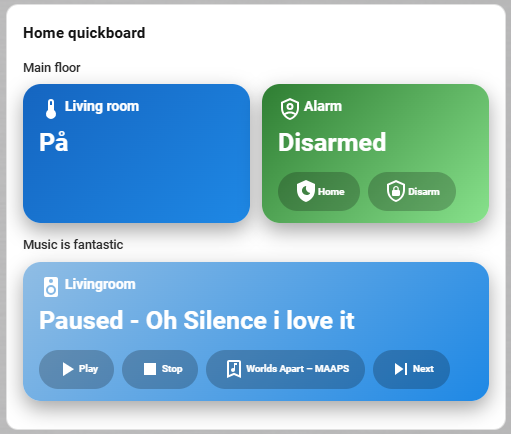
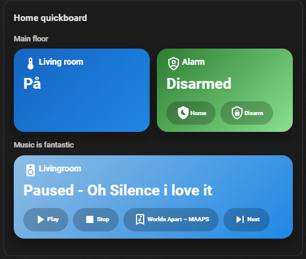

# Andy Quickboard Card v1.2.1

Andy Quickboard Card is a flexible Home Assistant Lovelace card for building compact dashboards, control panels and navigation boards.

Buttons are arranged in rows and can either control or display an entity, or open another Quickboard menu. Menus can replace the current board or open as popups, can link to other menus, and can be nested to create complete navigation flows for rooms, device groups or any structure you prefer.

The card also includes reusable themes, state-aware color intervals, configurable shadows, badges, state-based icons and flexible tap actions. Everything runs in the browser and can be configured through the visual editor or YAML.

> Developed by **Andreas “AndyBonde”**, author of
> [`andy-temperature-card`](https://github.com/maglerod/andy-temperature-card) and
> [`andy-segment-display-card`](https://github.com/maglerod/andy-segment-display-card).

## Screenshots




## Features

### Rows and buttons

- Build the board row by row with any number of buttons.
- Add an optional label above or below each row, aligned left, center or right.
- Buttons automatically share the available row width.
- Use ordinary entity buttons and menu buttons together in the same row.
- Override icon visibility, unit and decimal places globally or per button.
- Use a single icon or state-based `state → icon` mappings.
- Optionally show a subtle Entity/Menu type symbol on the live card.

### Menus and submenus

- Create any number of reusable menus.
- Nest menus to build multi-level navigation.
- Open a menu by replacing the current board or as a popup.
- Link several menu buttons to the same existing menu.
- Navigate to another menu, the previous menu or directly to the main board.
- Optionally show built-in Back and Close controls. Popup menus always include Close so the user cannot become trapped in the popup.
- Choose what happens after an entity button is tapped inside a menu: stay, go back one level or close the menu flow.
- Populate every menu with rows and buttons that use their own badges, colors and theme inheritance.

Menu buttons can display status in three ways:

- **Automatic active/total** counts active entities in the destination menu and uses the active count for color intervals.
- **Status entity** uses a selected entity's state and attributes.
- **None** hides menu status completely.

### Color intervals

- Define global color intervals using numeric ranges or exact state matching.
- Add per-button intervals that replace the global intervals for that button.
- Choose interval-based colors or a fixed custom gradient for an individual button.
- Set a solid background or gradient, text/icon color and active shadow color per interval.
- Add custom state labels and suffix text.
- Use template variables such as `<state>`, `<unit>`, `<dimmer_pct>`, `<source>`, `<title>`, `<artist>`, `<album>` and `<title_artist>`.
- Independently choose whether a matched interval overrides an active theme's button color and/or text/icon color.

### Reusable themes

- Create reusable button themes with gradient, text color, border, radius, shadow and badge style.
- Assign themes globally, to the main menu, to a submenu, to a row or to one button.
- Theme priority is **button → row → menu → global**.
- Select **No theme** at an override level to return to intervals or custom button colors.
- Intervals can still provide state-dependent colors when their theme override options are enabled.

### Shadows and appearance

- Configure the default button radius and padding.
- Choose from None, Soft, Medium, Strong and Glow shadow presets.
- Control shadow strength globally and override it in themes or on individual buttons.
- Use the Home Assistant theme color, active theme/interval color, a custom color or classic black as the shadow color source.
- Use an interval's active shadow color to create state-dependent glow effects.
- Enable or disable the hover lift effect.

### Badges

Every entity or menu button can contain multiple badges. Badge styles can inherit from the global setting or theme, and can be overridden for one button.

- **Value** — display another entity's current value.
- **Dimmer** — display and control a light's brightness.
- **Statistics** — min, max, average, last on, last off or last changed over a configurable history window.
- **Media control** — play/pause, play, pause, stop, next, previous, volume up/down or mute.
- **Media information** — title, artist, album, source or title + artist.
- **Alarm control** — arm home, arm away, arm night or disarm, with an optional code.
- Optional icon, label, unit and decimal-place override per badge.
- Available styles: Pill, Pill strong, Chip, Underline and None.

> Statistics use Home Assistant's history REST endpoint through `hass.callApi()`.

### Tap actions

Each entity button supports:

- `toggle`
- `more-info`
- `navigate`
- `url`
- `call-service`
- `none`
- `default`, which selects a suitable action from the entity domain

The default behavior toggles lights, switches, fans and input booleans; runs scripts; opens or closes covers; locks or unlocks locks; activates scenes, buttons, input buttons and automations; and opens the standard more-info dialog for other domains.

### Home Assistant integration

- Full visual editor support; YAML is optional.
- Uses a normal `ha-card` and works with `card-mod`.
- Runs fully in the browser with no custom backend integration.

## Menu buttons explained

A menu is a reusable collection of rows and buttons. A menu button is simply a button whose destination points to one of those menu definitions.

For example, the main board can contain a **Lights** button. That button opens a menu containing **Bedroom**, **Kitchen** and **Bathroom**. The Bedroom button can then open another menu containing the individual bedroom lights. There is no fixed nesting limit imposed by the card, so the same pattern can be extended as far as the dashboard needs.

### Navigation modes

| Mode | Behavior |
| --- | --- |
| Replace current menu | Opens the destination in the current Quickboard area and adds it to the navigation history. |
| Popup | Opens the destination above the current board. A Close control is always available. |
| Previous menu | Uses the special target `__back__` to return one navigation level. |
| Main menu | Uses the special target `__root__` to return directly to the main board. |

### Action after tap

Each menu has a default action that runs after an ordinary entity button inside that menu is tapped:

| Action | Result |
| --- | --- |
| Stay | Keep the current menu open. |
| Go back | Return one level after the entity action runs. |
| Close | Close the popup or return the replaced menu flow to the main board. |

Navigation buttons keep their own destination behavior and are not affected by this setting.

### Creating a menu in the visual editor

1. Open **Menus & submenus** and select **Add menu**.
2. Give the menu a title and stable Menu ID.
3. Add rows and buttons to the menu just as you would on the main board.
4. Open a button under **Main menu rows & buttons** or inside another menu.
5. Change **Button type** to **Menu button**.
6. Select the destination and choose **Replace current menu** or **Popup**.
7. Choose its status mode and whether a Back control should be shown.

The same destination menu can be selected by several buttons. Renaming a Menu ID in the visual editor updates existing links to it.

### Menu YAML options

Menu definitions are stored in the top-level `menus` list:

| Option | Description |
| --- | --- |
| `id` | Unique destination ID used by menu buttons. |
| `title` | Menu title shown on the card. |
| `rows` | Rows and buttons contained in the menu. |
| `action_after_tap` | `stay`, `back` or `close` after an entity button is tapped. |
| `theme_id` | Optional theme override for the menu. |
| `group` | Optional organizational group used by the visual editor. |
| `description` | Optional editor note. |

The following options turn an item in a row into a menu button:

| Option | Description |
| --- | --- |
| `button_type: menu` | Marks the button as a menu button. |
| `menu_target` | Destination Menu ID, `__back__` or `__root__`. |
| `menu_display` | `replace` or `popup`. |
| `menu_show_back` | Shows a built-in Back control in the opened menu. |
| `menu_show_close` | Shows a Close control for a replaced menu. Popup Close is always enabled. |
| `menu_state_mode` | `auto`, `entity` or `none`. |
| `entity` | Optional status entity when `menu_state_mode: entity` is used. |

Menu buttons also support `badges`, `color_intervals`, custom colors, themes and shadow settings just like entity buttons.

## Installation

### Option A — HACS

1. Open **HACS** in Home Assistant.
2. Go to **Frontend**.
3. Search for **Andy Quickboard Card**.
4. Open the card and select **Download**.
5. Reload the frontend or restart Home Assistant if required.

HACS normally adds the Lovelace resource automatically.

### Option B — HACS custom repository

Use this method if the card is not available in your HACS search:

1. Open **HACS** and select **Custom repositories** from the three-dot menu.
2. Add `https://github.com/maglerod/andy-quickboard-card`.
3. Select **Lovelace** as the category.
4. Install **Andy Quickboard Card** from the HACS Frontend section.

### Option C — Manual installation

1. Download [`dist/andy-quickboard-card.js`](dist/andy-quickboard-card.js).
2. Copy it to `/config/www/andy-quickboard-card.js`.
3. Go to **Settings → Dashboards → Resources**.
4. Add `/local/andy-quickboard-card.js?v=1.2.1` as a **JavaScript Module**.
5. Save and perform a hard refresh (`Ctrl+F5` or `Cmd+Shift+R`).

## Add the card

### Visual editor

1. Edit a Home Assistant dashboard.
2. Select **Add card**.
3. Search for **Andy Quickboard Card**.
4. Configure the rows, buttons and optional menus, then save.

### Basic YAML example

```yaml
type: custom:andy-quickboard-card
title: Home quickboard
color_intervals:
  - from: 0
    to: 21
    color_from: "#C62828"
    color_to: "#E53935"
    text_color: "#FFFFFF"
  - from: 21
    to: 66
    color_from: "#F9A825"
    color_to: "#F57F17"
    text_color: "#FFFFFF"
  - from: 66
    to: 101
    color_from: "#2E7D32"
    color_to: "#43A047"
    text_color: "#FFFFFF"
rows:
  - label: Batteries
    label_position: top-left
    entities:
      - entity: sensor.phone_battery
        name: Phone
        icon: mdi:cellphone
      - entity: sensor.watch_battery
        name: Watch
        icon: mdi:watch
```

### Nested menu YAML example

```yaml
type: custom:andy-quickboard-card
title: Home

color_intervals:
  - from: 0
    to: 1
    color_from: "#546E7A"
    color_to: "#37474F"
    text_color: "#FFFFFF"
  - from: 1
    to: 999
    color_from: "#F9A825"
    color_to: "#F57F17"
    text_color: "#FFFFFF"

rows:
  - label: Navigation
    label_position: top-left
    entities:
      - button_type: menu
        name: Lights
        icon: mdi:lightbulb-group
        menu_target: lights
        menu_display: popup
        menu_show_back: true
        menu_state_mode: auto

menus:
  - id: lights
    title: Lights
    action_after_tap: stay
    rows:
      - label: Rooms
        label_position: top-left
        entities:
          - button_type: menu
            name: Bedroom
            icon: mdi:bed
            menu_target: bedroom_lights
            menu_display: replace
            menu_show_back: true
            menu_state_mode: auto
          - entity: light.kitchen
            name: Kitchen
            icon: mdi:countertop

  - id: bedroom_lights
    title: Bedroom lights
    action_after_tap: close
    rows:
      - entities:
          - entity: light.bedroom_ceiling
            name: Ceiling
          - entity: light.bedside_left
            name: Left bedside
          - entity: light.bedside_right
            name: Right bedside
```

### Reusable theme YAML example

```yaml
button_themes:
  - id: evening
    name: Evening
    color_from: "#4527A0"
    color_to: "#7E57C2"
    text_color: "#FFFFFF"
    border_color: "#B39DDB"
    border_width: 1
    border_radius: 18
    box_shadow: 0 0 18px rgba(0, 0, 0, 0.45)
    shadow_strength: 65
    shadow_color_mode: active
    badge_style: pill

default_theme_id: evening
```

## Updating

After replacing the JavaScript file or installing a new HACS release, reload Home Assistant's frontend and perform a hard refresh. If the browser still uses an older file, update the version query in the manual resource URL.

See [CHANGELOG.md](CHANGELOG.md) for release changes.

## Support the project

I build and maintain Home Assistant cards in my spare time and share them freely with the community. If Andy Quickboard Card is useful in your setup, you can support continued development here:

<a href="https://www.buymeacoffee.com/AndyBonde" target="_blank">
  
</a>
